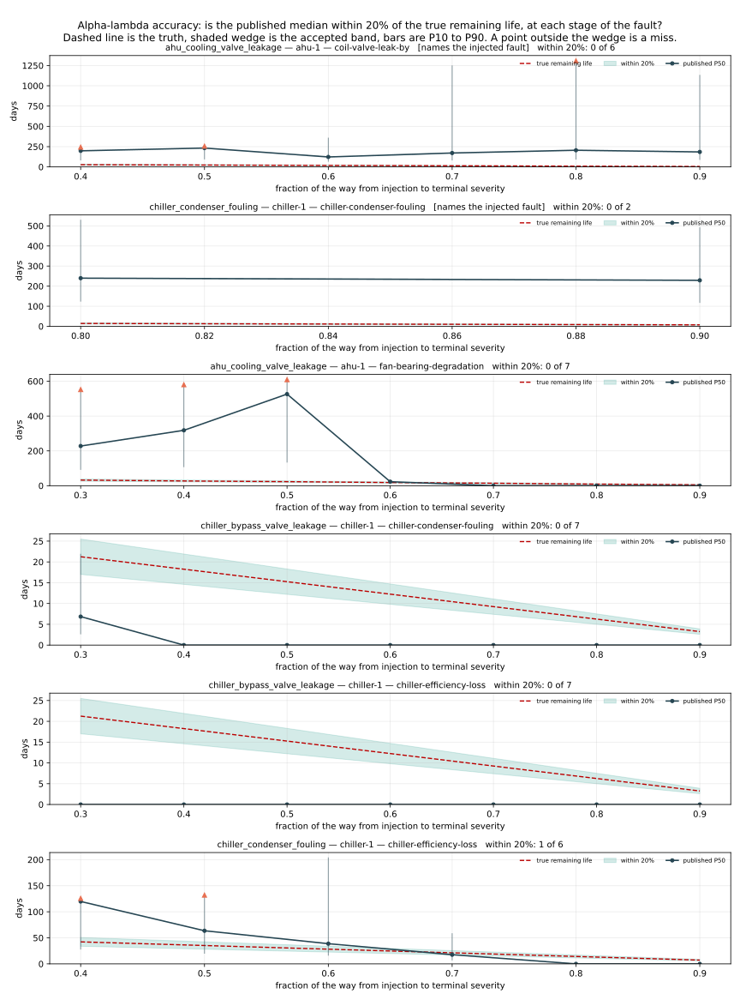

# Validation

> **Generated by `validation/harness.py` on 2026-07-31 06:34:15 UTC. Do not edit by hand.**
> Every number in this document is recomputed from the database and the answer key on
> each run and the file is overwritten in place. Regenerate with `make validate`.

The labels these results are scored against were not created by this project. The
fault signatures come from the LBNL Fault Detection and Diagnostics Datasets, a public
release produced by a consortium of LBNL, PNNL, NREL, ORNL and Drexel, in which each
fault is simulated at several measured severities alongside a fault-free reference
run. What this project synthesised is the trajectory BETWEEN those measured
severities, because no public run-to-failure dataset exists for building HVAC
equipment. The answer key therefore holds two kinds of fact: which fault was injected
into which machine, which is LBNL's, and when it passed each severity rung, which is
this project's.

The separation is enforced by the database rather than by discipline. Every layer that
detects, scores, baselines, predicts or diagnoses connects as a role with no access
whatsoever to schema `groundtruth` -- not restricted access, none -- and the answer key
is opened by exactly one module, `validation/groundtruth.py`, under a different
credential. No detector in this project can have seen the label it is scored against.

**What was evaluated.** 9 windows spanning 2018-01-01 to 2039-09-23.
3,384 asset-days hold readings; of those, 2,003 are days on which at least
one detector was willing to judge the machine, and only those can appear in a table
below. 24 findings were raised across every detector.

The gap between those two counts is not rounding. The rules decline to evaluate an
air handler while the building is unoccupied, and decline to evaluate a chiller that
is not running, for an hour after it starts, and at any instant below a minimum load.
One of the three chillers in this plant runs about one percent of the year. Counting
its idle days as days it was correctly found healthy would have added hundreds of free
true negatives to every table below and quietly divided the false-alarm rate.

## 1. False alarms per asset-day

**This is the first number in this document on purpose.** Automated fault detection in
buildings does not usually fail by missing faults. It fails by crying wolf: the
detection works, the operator is interrupted several times a day by findings that turn
out to be a warm afternoon or a scheduled setpoint change, and within a month nobody
opens the screen again. A system with perfect recall and one spurious finding per
machine per day has trained the person it was bought for to ignore it, and is worth
less than no system at all. So the rate on equipment that was working comes before any
claim about equipment that was not.

Counted over asset-days labelled healthy: the two synthesised fault-free runs, the
LBNL fault-free reference year, and the pre-injection stretch of every faulted run.
Pre-injection days are ordinary healthy days here, including the three weeks the
baselines are fitted on -- a finding raised while the equipment was still healthy is a
false alarm whatever else was happening that week.

Three counts, because they answer different questions:

- **findings per asset-day** is the headline. A finding is one (machine, fault) pair
  raised once, however many separate episodes it covered -- the unit an operator
  disposes of. Nine afternoons of the same saturated valve is one finding, not nine.
- **alarm-days** is the share of healthy days with at least one finding standing. It
  is exactly the false-positive count in section 2's confusion matrix, so the two
  sections cannot disagree.
- **episodes** is the raw count of sustained stretches, carried only so these figures
  line up against the per-rule tables produced in checkpoints 3.3 and 3.4.

| run | healthy asset-days | findings | findings per asset-day | alarm-days | episodes | detectors evaluated |
| :--- | ---: | ---: | ---: | ---: | ---: | :--- |
| `lbnl-fault-free-year` | 778 | 0 | **0.0000** | 0 (0.0%) | 0 | rules only |
| `clean_chiller` | 215 | 2 | **0.0093** | 139 (64.7%) | 2 | rules and confirmed degradation |
| `clean_ahu` | 117 | 0 | **0.0000** | 0 (0.0%) | 0 | rules and confirmed degradation |
| `chiller_bypass_valve_leakage` | 21 | 0 | **0.0000** | 0 (0.0%) | 0 | rules and confirmed degradation |
| `chiller_condenser_fouling` | 21 | 0 | **0.0000** | 0 (0.0%) | 0 | rules and confirmed degradation |
| `ahu_sat_sensor_drift` | 20 | 0 | **0.0000** | 0 (0.0%) | 0 | rules and confirmed degradation |
| `ahu_cooling_valve_leakage` | 18 | 0 | **0.0000** | 0 (0.0%) | 0 | rules and confirmed degradation |
| `ahu_oa_damper_stuck` | 18 | 0 | **0.0000** | 0 (0.0%) | 0 | rules and confirmed degradation |
| **ALL HEALTHY ASSET-DAYS** | **1,208** | **2** | **0.0017** | **139** | **2** |  |

**0.0017 findings per healthy asset-day** across 1,208 asset-days of equipment that was working: one finding every 604 asset-days.

## 2. Detection at severity level 1

### Why every accuracy figure here is restricted to level 1

LBNL publishes each fault at several measured severities. Condenser fouling comes at
95% and 65% of heat transfer retained; bypass leakage at 25%, 50% and 75%; the damper
stuck at 10%, 25% and 75% open. **Detecting the severe end of that range is not
evidence that a fault detection system works.** A condenser down to 65% of its heat
transfer moves the approach temperature and the kilowatts per ton so far outside
anything weather can explain that a fixed threshold set by hand would catch it. The
severe cases are the ones any system catches, and an accuracy figure computed over a
whole trajectory is dominated by them.

Severity level 1 is the opposite case. It is the mildest condition LBNL measured for
that fault -- a valve leaking slightly, 5% of heat transfer lost -- and its effect on
every signal is of the same order as the effect of the outdoor air temperature being a
few degrees higher than yesterday. Separating it from normal operation is the whole
problem. It is also the only case where a warning is worth anything, because by the
time the fault reaches its terminal severity the energy has already been spent.

So the severity-1 window of each run is reconstructed by replaying the same seeded
trajectory the simulator built the run from, and it closes the moment the trajectory
reaches the SECOND measured rung. Every asset-day after that is excluded from the
figures below rather than counted as an easy win.

### What counts as a detection

A detection is a claim about a MACHINE on a DAY: the platform told an operator
something was wrong with this unit today. Any of the nine physics-derived rules, or
any failure mode whose degradation the changepoint detector confirmed, counts.

Two things follow, and both cut against the numbers rather than for them. The rule
firings are re-run from the measurements here rather than read from a table, because
nothing persists them. The degradation detections are also re-run, for a subtler
reason: `app.health_state` stores the changepoint detector's ESTIMATED onset -- the
retrospective "this began on the 3rd" -- and an operator learned nothing on the 3rd.
They learned when the cumulative-sum statistic crossed its decision interval, which is
days later and is written down nowhere. Scoring against the estimated onset would
credit this system with warning it never gave, so the health layer is recomputed and
the confirmation instant is used.

The claim is also deliberately generous in one direction, stated plainly: it is
asset-level, so a run is credited when ANY channel fires on the faulted machine, not
only when the correct fault is named. During condenser fouling the efficiency-loss mode
firing is physically the same fault seen from another angle and crediting it is fair;
during sensor drift, a mode firing for an unrelated reason would also be credited and
that is not. Whether the right fault was NAMED is a separate question and these figures
do not answer it.

### Confusion over 1,350 labelled asset-days

A further 653 asset-days were judged by a detector but carry no label: the fault was present and had already passed level 1. They appear in neither row.

|  | platform flagged the machine | platform said nothing |
| :--- | ---: | ---: |
| **fault present, at level 1** | **108** true positive | 34 false negative |
| **equipment healthy** | 139 false positive | 1,069 true negative |

| metric | value | reading |
| :--- | ---: | :--- |
| **precision** | **43.7%** | of the days we raised something, this share had a real fault |
| **recall** | **76.1%** | of the days a mild fault was present, this share was flagged |
| **F1** | **0.555** | harmonic mean of the two |

### Where the false positives came from

| run | machine | channel | detector | false-positive asset-days | share of all false positives | same channel, same day of year, another run? |
| :--- | :--- | :--- | :--- | ---: | ---: | :--- |
| `clean_chiller` | chiller-2 | `chiller-efficiency-loss` | failure mode | 73 | 53% | **yes** — 2036-06-04, 2038-06-04 |
| `clean_chiller` | chiller-1 | `chiller-efficiency-loss` | failure mode | 66 | 47% | **yes** — 2038-07-03 |

**2 distinct false findings, out of 24 findings raised in
total**, and between them they stood for 139 healthy asset-days. Those are the
same result counted two ways and both are worth having: the platform put
2 wrong items in front of an operator, and
each then sat on the screen for two months afterwards. Precision is computed per
asset-day, so it is the second framing that drags it to 43.7%. Counted
as findings instead, 2 of 24 were raised on a machine with
nothing wrong with it.

`chiller-efficiency-loss` on `chiller-2` alone is 53% of the false-positive
total. Its detail: degradation confirmed 2039-06-04, 3.0 days after the change it attributes to 2039-06-01; health falls to 99 over 73 open days. So the whole finding is a confirmed change costing
1 health point out of a hundred -- and the rightmost
column above is the more damning part of it. That channel raises the same finding on the
same machine on the same day of the year across several runs, faulted and fault-free
alike. Every run reads the same 2018 source data shifted by whole years, so a detection
repeating on the same calendar day is responding to something in the weather and load of
that week rather than to the condition of the machine. What exactly, these measurements
do not establish -- the indicator's mean over the fault-free run is within 0.01 of zero,
so it is not a steady seasonal drift, and identifying the mechanism belongs with the
indicator rather than with the harness.

It is a real false positive and it would reach an operator. It would arrive at the bottom
of the queue rather than as an alarm -- 1 health point
produces almost no severity and almost no cost of inaction -- which is what the ranking in
the advisory layer is for. But ranking it low is not the same as being right about it, and
this is the clearest defect these measurements expose.

### Per injected fault

4 of 4 injected faults were caught while still at severity level 1.

| run | machine | injected fault | LBNL's mildest measured case | level-1 window, days | caught at level 1 | days to first warning | which channel fired first | level-1 days flagged |
| :--- | :--- | :--- | :--- | :--- | :---: | ---: | :--- | ---: |
| `ahu_cooling_valve_leakage` | ahu-1 | `cooling_coil_valve_leakage` | leaking (single measured severity) | 45.0 | **yes** | 9.8 | coil-valve-leak-by | 32/41 (78%) |
| `chiller_condenser_fouling` | chiller-1 | `condenser_fouling` | 95% heat transfer retained | 40.3 | **yes** | 18.8 | chiller-efficiency-loss | 21/41 (51%) |
| `chiller_bypass_valve_leakage` | chiller-1 | `bypass_valve_leakage` | 25% bypass leakage | 9.8 | **yes** | 1.8 | chiller-condenser-fouling | 9/11 (82%) |
| `ahu_sat_sensor_drift` | ahu-1 | `supply_air_temperature_sensor_drift` | +2F sensor bias | 49.5 | **yes** | 2.8 | fan-bearing-degradation | 46/49 (94%) |

### Runs excluded from these figures, and why

| run | why it is not in the figures above |
| :--- | :--- |
| `cooling_tower_fouling` | held out by design. No rule in this project references a cooling tower point, a tower approach temperature or the wet-bulb temperature, and no failure mode is configured for the tower. Scoring it as a missed detection would charge the rule library for a fault it was deliberately never given, and scoring it as fault-free would credit the chillers for staying quiet while their condenser water got warmer. It is reported separately. |
| `ahu_oa_damper_stuck` | step fault: jumps straight to rung 3 of 3 at injection, so it is never present at level 1 and detecting it is not the hard case |

6 faults are recorded in the answer key in total. The held-out one is reported on its own in section 4.

## 3. Lead time

The gap between the first warning and the failure is what this system is for.
Detecting a fault the week the equipment stops is a report, not a prediction.

The population is one row per (injected fault, detection channel), not one row per
fault. That is what makes a distribution out of a handful of events: condenser fouling
is caught by the approach-temperature rule, by the kilowatt-per-ton rule, and by two
separate degradation modes, and those warnings arrive on four different days. Quoting
only the earliest would describe a system that always warns as early as its luckiest
detector. The **tenth percentile is the number to read** -- nine warnings in ten
arrived at least this far ahead -- and the median is the typical case.

Failure here means the injected fault reaching its terminal severity, which is the
answer key's `t_failure`. That is not the same event as the indicator crossing the
physically justified threshold the remaining-life model predicts, and the two dates can
differ by weeks -- an important distinction, because it means a lead time measured here
and a remaining-life error are answers to two different questions.

| injected fault | warnings | median lead, days | 10th percentile, days | worst | best | earliest channel |
| :--- | ---: | ---: | ---: | ---: | ---: | :--- |
| `bypass_valve_leakage` | 5 | 26.6 | 26.2 | 26.1 | 28.2 | chiller-condenser-fouling on chiller-1 |
| `condenser_fouling` | 4 | 20.9 | 13.1 | 10.5 | 51.2 | chiller-efficiency-loss on chiller-1 |
| `cooling_coil_valve_leakage` | 2 | 34.2 | 33.5 | 33.2 | 35.2 | coil-valve-leak-by on ahu-1 |
| `supply_air_temperature_sensor_drift` | 2 | 45.3 | 11.8 | 3.4 | 87.2 | fan-bearing-degradation on ahu-1 |
| **ALL FAULTS POOLED** | **13** | **26.6** | **12.2** | **3.4** | **87.2** | **fan-bearing-degradation on ahu-1** |

### Every warning, individually

| run | machine | detector | channel | first warning | terminal severity reached | lead, days |
| :--- | :--- | :--- | :--- | :--- | :--- | ---: |
| `chiller_bypass_valve_leakage` | chiller-1 | failure mode | `chiller-condenser-fouling` | 2037-06-02 | 2037-06-30 | **28.2** |
| `chiller_bypass_valve_leakage` | chiller-1 | failure mode | `chiller-efficiency-loss` | 2037-06-02 | 2037-06-30 | **28.2** |
| `chiller_bypass_valve_leakage` | chiller-1 | rule | `chiller-capacity-shortfall` | 2037-06-03 | 2037-06-30 | **26.6** |
| `chiller_bypass_valve_leakage` | chiller-1 | rule | `chiller-excess-lift` | 2037-06-03 | 2037-06-30 | **26.3** |
| `chiller_bypass_valve_leakage` | chiller-1 | rule | `chiller-kw-per-ton-residual` | 2037-06-04 | 2037-06-30 | **26.1** |
| `chiller_condenser_fouling` | chiller-1 | failure mode | `chiller-efficiency-loss` | 2036-06-19 | 2036-08-09 | **51.2** |
| `chiller_condenser_fouling` | chiller-1 | rule | `chiller-kw-per-ton-residual` | 2036-07-17 | 2036-08-09 | **22.6** |
| `chiller_condenser_fouling` | chiller-1 | failure mode | `chiller-condenser-fouling` | 2036-07-21 | 2036-08-09 | **19.2** |
| `chiller_condenser_fouling` | chiller-1 | rule | `chiller-capacity-shortfall` | 2036-07-29 | 2036-08-09 | **10.5** |
| `ahu_cooling_valve_leakage` | ahu-1 | failure mode | `coil-valve-leak-by` | 2036-03-27 | 2036-05-01 | **35.2** |
| `ahu_cooling_valve_leakage` | ahu-1 | failure mode | `fan-bearing-degradation` | 2036-03-29 | 2036-05-01 | **33.2** |
| `ahu_sat_sensor_drift` | ahu-1 | failure mode | `fan-bearing-degradation` | 2038-06-20 | 2038-09-15 | **87.2** |
| `ahu_sat_sensor_drift` | ahu-1 | rule | `apar-20` | 2038-09-11 | 2038-09-15 | **3.4** |

### Findings that were not warnings

Raised only after the injected fault had already reached terminal severity, so they carry no lead and are excluded from the distribution above rather than averaged into it.

| run | machine | channel | days after terminal severity |
| :--- | :--- | :--- | ---: |
| `ahu_oa_damper_stuck` | ahu-1 | `fan-bearing-degradation` | 7.8 |
| `ahu_sat_sensor_drift` | ahu-1 | `apar-7` | 0.9 |

## 4. The held-out fault

Cooling tower fouling is held out on purpose. No rule in this project references a
cooling tower point, a tower approach temperature or the wet-bulb temperature, and no
failure mode is configured for the tower. It is excluded from every figure above --
scoring it as a missed detection would charge the rule library for a fault it was
deliberately never given, and scoring it as fault-free would credit the chillers for
staying quiet while their condenser water got warmer -- and it is reported here
instead.

**0 rule firings.** The rule library was silent on it, which is the
result that was designed for.

Something did fire, from the degradation layer, and the obvious reading of that is
that the trending caught what the rules could not. The obvious reading is testable.
Every synthesised run reads the same 2018 source window shifted by a whole number of
years, so a detection driven by the weather lands on the same day of the year in every
run and a detection driven by the injected fault does not. Each finding below is
therefore checked against the fault-free runs for the same machine, the same channel
and the same calendar day.

| machine | detector | channel | first raised | active days | same finding on a fault-free run? |
| :--- | :--- | :--- | :--- | :--- | :--- |
| chiller-1 | failure mode | `chiller-efficiency-loss` | 2038-07-03 | 66 | **2039-07-03**, same day of the year |
| chiller-2 | failure mode | `chiller-efficiency-loss` | 2038-06-04 | 73 | **2039-06-04**, same day of the year |

**Every finding on this run has a fault-free twin, so the tower fouling was not detected.** What fired is the same artefact that fires on a run with no fault in it at all, on the same day of the year, on the same machines. The honest reading is not that the degradation layer caught a fault the rules could not; it is that the degradation layer was already saying this before the tower fouled.

## 5. Remaining-life interval calibration

A P10-to-P90 band is a promise: the truth should fall inside it about **80%** of the
time. Wider than that and the band is too vague to plan around; narrower and the number
on the screen is not the number the mathematics computed. Neither failure is visible from
one prediction, or from watching a band narrow. It only shows up by counting.

**It does not come out at 80%. It comes out at 10.1%
against the answer key's failure date, and 0.0% on
the two series where the mode being scored is the mode that names the injected fault.**
That is reported here because a calibration section that only appeared when the answer was
flattering would be worth nothing, and because the shape of the failure turns out to be
more informative than the headline.

### Coverage, pooled four ways

| population | series | estimates with both ends bounded | covered | coverage | missed LATE | missed EARLY | one end unbounded |
| :--- | ---: | ---: | ---: | ---: | ---: | ---: | ---: |
| matched mode, against the answer key | 2 | 41 | 0 | **0.0%** | 41 | 0 | 10 |
| matched mode, against the indicator crossing | 0 | 0 | 0 | **n/a** | 0 | 0 | 0 |
| any mode on the faulted machine, against the answer key | 7 | 148 | 15 | **10.1%** | 42 | 91 | 37 |
| any mode on the faulted machine, against the indicator crossing | 3 | 13 | 1 | **7.7%** | 12 | 0 | 14 |

**The misses split into two distinct populations, and the split is the finding.** Scored
against the answer key across every mode, 42 of 133
misses put the failure LATER than it turned out to be and 91 put it earlier.
But on the 41 matched estimates -- the ones where the mode
being scored is the mode that names the injected fault -- the direction is uniform:
41 late and 0 early. The same
holds against the indicator's own crossing: 12 late,
0 early.

The early misses come from somewhere specific. They are modes whose indicator had ALREADY
crossed its own failure threshold before the answer key's terminal severity arrived, so the
model correctly reports zero days remaining while the answer key still has days left to run.
That is not the model being optimistic; it is the same threshold-versus-terminal-severity
mismatch as the late misses, seen from the other side. **Where the model is genuinely wrong
it is wrong late**, which is the dangerous direction for a maintenance system -- it tells a
planner they have time they do not have.

### Per series, with the number that changes how to read it

| run | machine | mode | names the injected fault | failure date used | target | estimates in horizon | bounded | covered | coverage | late | early | how far the indicator got toward its own threshold |
| :--- | :--- | :--- | :--- | :--- | :--- | ---: | ---: | ---: | ---: | ---: | ---: | ---: |
| `ahu_cooling_valve_leakage` | ahu-1 | `coil-valve-leak-by` | **yes** | answer key terminal severity | 2036-05-01 | 31 | 21 | 0 | **0%** | 21 | 0 | 57% |
| `chiller_condenser_fouling` | chiller-1 | `chiller-condenser-fouling` | **yes** | answer key terminal severity | 2036-08-09 | 20 | 20 | 0 | **0%** | 20 | 0 | 16% |
| `ahu_cooling_valve_leakage` | ahu-1 | `fan-bearing-degradation` | no | answer key terminal severity | 2036-05-01 | 34 | 21 | 0 | **0%** | 1 | 20 | 8% |
| `ahu_sat_sensor_drift` | ahu-1 | `fan-bearing-degradation` | no | answer key terminal severity | 2038-09-15 | 8 | 8 | 0 | **0%** | 0 | 8 | 37% |
| `chiller_bypass_valve_leakage` | chiller-1 | `chiller-condenser-fouling` | no | answer key terminal severity | 2037-06-30 | 22 | 22 | 2 | **9%** | 0 | 20 | 355% |
| `chiller_bypass_valve_leakage` | chiller-1 | `chiller-condenser-fouling` | no | indicator crossed its own threshold | 2037-06-09 | 1 | 1 | 0 | **0%** | 1 | 0 | 355% |
| `chiller_bypass_valve_leakage` | chiller-1 | `chiller-efficiency-loss` | no | answer key terminal severity | 2037-06-30 | 24 | 24 | 0 | **0%** | 0 | 24 | 2290% |
| `chiller_bypass_valve_leakage` | chiller-1 | `chiller-efficiency-loss` | no | indicator crossed its own threshold | 2037-06-03 | 0 | 0 | 0 | **n/a** | 0 | 0 | 2290% |
| `chiller_condenser_fouling` | chiller-1 | `chiller-efficiency-loss` | no | answer key terminal severity | 2036-08-09 | 46 | 32 | 13 | **41%** | 0 | 19 | 205% |
| `chiller_condenser_fouling` | chiller-1 | `chiller-efficiency-loss` | no | indicator crossed its own threshold | 2036-07-20 | 26 | 12 | 1 | **8%** | 11 | 0 | 205% |

The rightmost column is the one that separates two very different problems.

**On the two matched series the indicator never got near its own failure threshold.** The
coil valve leak reached 57% of the way there and the condenser fouling reached 16%, over
runs the answer key calls failures. So when the model says the crossing is two hundred
days off while the answer key's terminal severity arrives in nineteen, the model is not
obviously wrong -- it is answering the question it was built to answer, which is when the
indicator will reach a threshold that has a physical justification recorded next to it.
The answer key's date is a different event: the last rung of the measured severity ladder.
**Most of the 0% on the matched population is those two events being weeks apart, not the
band being miscalibrated.**

**Where the model's own event did happen, the band still misses, and still late.** The
efficiency indicator on the fouling run crossed its threshold on its own, and there the
coverage against that crossing is 7.7% over
13 bounded estimates. Two days before the indicator
actually crossed, the published median was still nearly ten times the true remaining life.
**That is a genuine calibration failure and it is not explained away by the threshold.** It
rests on 13 estimates, which is a small sample and is
stated as one.

The likely mechanism, stated as a hypothesis rather than a result because this harness does
not test it: the drift rate is fitted over every post-onset daily increment with equal
weight, so a fault whose rate rises late in its life is projected forward at its average
rate rather than its current one, and the average is lower. Nothing here isolates that from
the alternatives, and the fix belongs with the degradation model.

### Estimates that cannot be calibrated at all

The platform published 1,117 remaining-life estimates. **185 of them
are scoreable against the answer key** and 932 are not; the two add to
1,117, which is the whole population, because every estimate falls
into exactly one group below. Reconciling that is not pedantry -- a coverage figure whose
denominator cannot be tied back to what the system actually published is not a measurement,
and an earlier version of this table did not close.

| estimates | group | why they cannot be scored |
| ---: | :--- | :--- |
| 306 | made after the failure date they would be scored against | the replay continues to the end of the run, so it keeps publishing after the fault has already reached terminal severity. A band lying entirely in the future cannot contain a date in the past |
| 218 | on the held-out run `cooling_tower_fouling` | held out by design |
| 176 | on a machine coupled to the faulted one, not the faulted one itself | the chiller data is a whole-plant simulation, so a machine beside the faulted one is neither faulted nor assertably healthy and has no failure date of its own to be scored against |
| 145 | on the fault-free run `clean_chiller` | no fault was injected, so there is no failure date for a band to contain. These estimates are the remaining-life layer forecasting a failure on a machine that was working |
| 87 | on the step-fault run `ahu_oa_damper_stuck` | terminal severity is reached at injection, so remaining life is zero from the first instant and there is nothing to predict |

One of those rows belongs beside section 1. **145 estimates were published on a
machine with no fault injected into it** -- the remaining-life layer naming a failure date
for a chiller that was working. That is the same false positive section 1 attributes to the
efficiency channel, followed one layer downstream, and it is the clearest illustration of
why the false-alarm rate is the first number in this document rather than the last.

## 6. Alpha-lambda accuracy

The standard prognostics accuracy question, and the reason it is a cone rather than a
tolerance: is the published median within 20% of the true remaining life,
checked at each fraction of the way from injection to terminal severity. 20%
of ninety days is eighteen days of slack; 20% of five days is one. So the
acceptable region closes on zero as the end approaches, and a prediction can pass early and
fail late without the model having changed. That is the property the metric exists to expose.

The fraction 1.0 is left out on purpose: at the failure date the true remaining life is
zero, so the accepted band has zero width and every prediction fails by construction. That
is arithmetic, not a result.

**0 of 8 checks pass on the series that name the injected
fault, and 1 of 35 across every series scored.**

| fraction of life elapsed | within 20%, matched series | within 20%, all series | hit rate, all series | P10-P90 contained the truth | median relative error of P50 |
| ---: | ---: | ---: | ---: | ---: | ---: |
| 0.1 | - | - | - | - | - |
| 0.2 | - | - | - | - | - |
| 0.3 | - | 0/3 | 0% | 1/3 | -68% |
| 0.4 | 0/1 | 0/5 | 0% | 0/5 | +183% |
| 0.5 | 0/1 | 0/5 | 0% | 0/5 | +80% |
| 0.6 | 0/1 | 0/5 | 0% | 1/5 | +26% |
| 0.7 | 0/1 | 1/5 | 20% | 1/5 | -100% |
| 0.8 | 0/2 | 0/6 | 0% | 0/6 | -100% |
| 0.9 | 0/2 | 0/6 | 0% | 0/6 | -100% |

**The early rows are empty by design, not by omission.** The remaining-life layer refuses to
publish anything until the changepoint detector has confirmed degradation, and on these runs
that confirmation lands between a third and two-thirds of the way through the fault's life.
So there is nothing to check at 0.1 or 0.2: the system was declining to answer, which
section 3 counts as detection latency and this section cannot score at all. An accuracy
metric that filled those rows in would be scoring predictions the platform never made.

The last column is the diagnosis, and it changes sign. Early in the measurable range the
median error is large and positive -- the prediction is long. Late in the range it goes to
-100%, which is one specific thing: the indicator has already crossed its own threshold, so
the model reports zero days remaining while the answer key still has a few days to run. Both
directions come from the same place, which is that the threshold and the terminal severity
are different events. What the metric does not show anywhere is a prediction that is merely
imprecise; the errors are structured, not scattered.

Read the figure rather than the table if you only look at one. The dashed line is the truth
falling to zero, the shaded wedge is the accepted band closing with it, the solid line is
the published median and the vertical bars are P10 to P90. An upward triangle marks an
estimate where the model declined to bound the upper end at all, which is an answer and is
drawn rather than omitted.

Two things to expect when you open it. On the two panels that name the injected fault, the
accepted wedge is too thin to see: the predictions run into the hundreds of days while the
truth is around ten, and at the scale the predictions force, the wedge collapses onto the
axis. That is the result, not a plotting defect. And on the bypass panels the median sits
flat on zero, which is the already-crossed case described above -- the indicator passed its
threshold early in the run and the model has been saying "no life left" ever since.

## 7. Sensor versus equipment

A supply air temperature above its setpoint is produced by a coil that cannot cool and by
a thermometer reading high, and from the symptom alone the two are identical. Getting them
the wrong way round dispatches a technician with a wrench to a fault that needs a
calibration kit, or a calibration technician to a machine that is genuinely failing. In
this project's own intervention library the two responses to that one symptom differ by
more than three times in cost, so the discrimination is worth money and not only tidiness.

**4 of 5 injected faults were classified correctly.** Before reading
that as a result, read the next number: a classifier that ignored the data and always
answered `equipment` would score 3 of 5. What makes the
figure worth having is not the total, it is which cases are in it -- the drifting
thermometer and the jammed damper are exactly the two a majority guess gets wrong, and
both are right, including which physical part to blame.

| true class \ said | **sensor** | **equipment** | **control** | **ambiguous** |
| :--- | ---: | ---: | ---: | ---: |
| **sensor** | **1** | 0 | 0 | 0 |
| **equipment** | 1 | **2** | 0 | 0 |
| **control** | 0 | 0 | **1** | 0 |

### The miss, and what it says about the relation set

- **`chiller_condenser_fouling` on chiller-1** had true class `equipment` and came out `sensor`, blaming `chiller-1.power`, with 2 of the machine's 3 relations violated. The classifier's own reasoning: assuming chiller-1.power reads +83538.930 wrong reconciles 99 percent of the violation across the 2 relations it appears in without making any of them worse, and 100 percent of the violation in its neighbourhood is on relations it can reach -- so the measurement is wrong and the machine is not.

The pattern behind that is worth more than the score. This test works by asking whether one
sensor reading consistently wrong would make every violated relation hold again, and it can
only answer no if the suspect appears in enough relations to be contradicted. **The air
handler contributes up to 5 relations; a chiller contributes up to
3.** On a chiller, electrical power participates in two of those three, so
once a fully developed fault has pushed two relations out at once, a single bias on the
power meter accounts for both and there is nothing left to falsify it with. The reasoning
above says exactly that in the classifier's own words: 99 percent of the violation
reconciled, across the two relations that point appears in.

This is the same falsifiability problem checkpoint 5.4 hit on the air side and solved by
adding the condition-normalised baselines as extra relations, which took supply air
temperature from one relation to three. The chiller never received that treatment. So the
honest reading of this section is not that the discrimination works; it is that **the
discrimination works where the relation set is rich enough to falsify a suspect, and the
count of relations is the thing to look at.** Adding chiller baselines is a
configuration change, not a code change, and it is in `ROADMAP.md`.

### Every classification, individually

| run | machine | injected fault | true class | said | confidence | subject named | relations violated | degrading | verdict |
| :--- | :--- | :--- | :--- | :--- | :--- | :--- | :--- | :--- | :--- |
| `ahu_cooling_valve_leakage` | ahu-1 | `cooling_coil_valve_leakage` | equipment | **equipment** | clear | - | 3/4 | yes | correct |
| `chiller_condenser_fouling` | chiller-1 | `condenser_fouling` | equipment | **sensor** | clear | chiller-1.power | 2/3 | yes | WRONG |
| `chiller_condenser_fouling` | chiller-2 | none injected | - | **equipment** | clear | - | 0/3 | yes | - |
| `chiller_condenser_fouling` | chiller-3 | none injected | - | **ambiguous** | clear | - | 0/1 | no | - |
| `ahu_oa_damper_stuck` | ahu-1 | `outdoor_air_damper_stuck` | control | **control** | clear | ahu-1.oa_damper | 2/4 | yes | correct |
| `chiller_bypass_valve_leakage` | chiller-1 | `bypass_valve_leakage` | equipment | **equipment** | clear | - | 2/3 | yes | correct |
| `cooling_tower_fouling` | chiller-1 | `cooling_tower_fouling` | equipment | **equipment** | clear | - | 0/3 | yes | held out |
| `cooling_tower_fouling` | chiller-2 | none injected | - | **equipment** | clear | - | 0/3 | yes | held out |
| `cooling_tower_fouling` | chiller-3 | none injected | - | **ambiguous** | clear | - | 0/1 | no | held out |
| `ahu_sat_sensor_drift` | ahu-1 | `supply_air_temperature_sensor_drift` | sensor | **sensor** | clear | ahu-1.sa_temp | 3/5 | yes | correct |
| `clean_chiller` | chiller-1 | none injected | - | **equipment** | clear | - | 0/3 | yes | - |
| `clean_chiller` | chiller-2 | none injected | - | **equipment** | clear | - | 0/3 | yes | - |
| `clean_chiller` | chiller-3 | none injected | - | **ambiguous** | clear | - | 0/1 | no | - |
| `clean_ahu` | ahu-1 | none injected | - | **ambiguous** | clear | - | 0/5 | no | - |

### What it says when nothing is wrong

The classifier has no "healthy" verdict; it returns one of four classes whenever it is
asked. So it is worth knowing what it answers on the fault-free runs, and the answer is not
uniform:

| run | machine | said | relations violated | degrading |
| :--- | :--- | ---: | ---: | ---: |
| `clean_chiller` | chiller-1 | **equipment** | 0/3 | yes |
| `clean_chiller` | chiller-2 | **equipment** | 0/3 | yes |
| `clean_chiller` | chiller-3 | **ambiguous** | 0/1 | no |
| `clean_ahu` | ahu-1 | **ambiguous** | 0/5 | no |

**2 of 4 healthy machines were given a fault class**, and in each case with zero relations violated -- the verdict comes entirely from the degradation flag, which on those machines is the false positive section 1 attributes to the efficiency channel. This is that same defect surfacing a third time, now as a diagnosis. The two machines with no degradation flag came out `ambiguous`, which is the closest thing this taxonomy has to saying nothing is wrong.

### The window this is scored over, and how it was chosen

Each machine is classified over **the last 28 days of its run**, against the three-week
commissioning window at that run's start as the healthy reference.

The window was chosen on operational grounds and not by which window scored best, and the
distinction matters because they are not the same window. In production this classifier
runs on a window ending now, which is what "the most recent 28 days" reproduces, and 28
matches the window the advisory layer already fits its health slope over, so the project
has one notion of "recently" rather than two. A longer window covering the whole
post-injection stretch was tried. It is measurably worse on the air handler -- across three
months reaching from winter into summer the cooling coil valve's average position drifts far
enough from its command that a leaking valve is reported as an actuator refusing orders --
and measurably better on the chiller. Choosing per equipment class would be fitting the
harness to the answer key, so one rule is applied and the run it gets wrong is reported as
wrong.

The reference is each run's own commissioning window because that exists for every run. A
fault-free run at the same time of year is the stronger choice and is what checkpoint 5.4
used, but two of the air-handler runs sit in late winter and early spring and the only
fault-free air-handler run is a summer one. The check that the substitution does not change
the answer is the coil-leak run, the one case where both references cover the same 28 days:
both return `equipment`.

This window is deliberately NOT restricted to severity level 1, which makes these figures
easier than the detection figures in section 2. The classifier works by asking which
relations have stopped holding; at level 1 on several of these runs nothing has visibly
stopped holding yet, so asking it to name a fault it cannot see measures the detector again
rather than the classifier. Detection is scored where detection is hard. Attribution is
scored where attribution is asked.

## 8. Cross-asset suppression correctness

The cross-asset layer marks a downstream symptom consequential when an upstream machine has
an open fault whose mechanism could produce it, and then ranks that advisory below the
advisory it blames. That is an inference, and the whole design of the layer -- demote,
never hide -- is a bet on the inference being wrong sometimes. This section checks whether
it was.

**What the answer key can settle, and what it cannot.** It can say what fault was injected
into which machine, so it can FALSIFY a consequential label: if a fault was injected
directly into the machine carrying the symptom, that symptom had a cause of its own and did
not need an upstream one. It cannot confirm a cross-asset link in the positive direction,
and the reason is in the source data. The two LBNL systems are independent simulations --
the air handler's chilled water comes from a boundary condition inside its own simulation,
not from this chiller -- so no run in this dataset contains a genuine chiller-caused air
handler symptom for the layer to get right. That absence is why checkpoint 6.1 had to
compose its target scenario, and it is stated rather than worked around.

| situation | run | window | data | open faults | demoted | verdict | demoted advisory ranked below its cause |
| :--- | :--- | :--- | :--- | :--- | :--- | :--- | :--- |
| real concurrency, air-handler run of 2038 | `ahu_sat_sensor_drift` | 2038-05-27 to 2038-09-24 | real | 5 | 0 | **CORRECT REFUSAL** | yes |
| real concurrency, air-handler run of 2036 | `ahu_cooling_valve_leakage` | 2036-05-31 to 2036-06-24 | real | 4 | 0 | **CORRECT REFUSAL** | yes |
| composed: the same 2038 window plus one era-shifted chiller fault | `ahu_sat_sensor_drift` | 2038-05-27 to 2038-09-24 | composed | 6 | 1 | **WRONG ATTRIBUTION** | yes |

- **real concurrency, air-handler run of 2038** — 5 faults open in this window, 2 of them on machines other than the air handler, and the plausibility map linked none of them. The open faults on the water side here cost power rather than capacity, so none of them can warm the chilled water the coil is fed with.
- **real concurrency, air-handler run of 2036** — 4 faults open in this window, 2 of them on machines other than the air handler, and the plausibility map linked none of them. The open faults on the water side here cost power rather than capacity, so none of them can warm the chilled water the coil is fed with.
- **composed: the same 2038 window plus one era-shifted chiller fault** — `ahu-1/apar-20` was blamed on `chiller-1/chiller-condenser-fouling`, but the answer key injected `supply_air_temperature_sensor_drift` directly into ahu-1 on this run, so the symptom had a cause of its own and needed no upstream explanation.

**2 correct refusals and 1 wrong attribution.** The refusals are
not filler. In both of those windows an upstream machine has an open fault and the timing
overlaps, so topology and concurrency both permit a link; the plausibility map declines
anyway, because the open upstream faults there cost power rather than capacity and cannot
warm the water the coil is fed with. A demotion layer that never declines to demote is
indistinguishable from one that demotes everything, so the negative cases are what make the
positive one mean anything.

**And the positive one is wrong.** On the composed window the air handler's saturated
cooling valve is blamed on the chiller's condenser fouling two hops upstream -- and the
answer key says the fault injected into that run was a supply air temperature sensor drift,
injected directly into the air handler. The symptom needed no upstream explanation. Section
7 reaches the same conclusion independently: the classifier names that machine's fault a
sensor fault, on the machine's own evidence, with no knowledge of the answer key.

This is the case the demote-rather-than-hide decision was made for. The advisory is ranked
below its supposed cause, and it is still on the operator's screen, carrying the sensor
badge and the reconciliation evidence that contradicts the attribution. Had the layer
suppressed it instead, a real fault would have been removed from the queue on the strength
of an inference that was wrong, and nothing on the screen would have said so. The ordering
mechanism is correct in all three situations; the inference it is applied to is wrong in
the one case this dataset can produce.

## Method, and what these numbers do not cover

### How the severity-1 boundary was found

The simulator builds a run by mixing consecutive measured-severity files in
proportion, driven by a progress curve seeded from the scenario's own integer seed.
Progress 0 sits on the fault-free file and progress 1 on the worst rung, so
multiplying progress by the number of rungs gives the position on the severity ladder
at every instant. The severity-1 window closes at the first instant that position
reaches 1.0. A fault with one measured rung never leaves level 1 and its window runs
to failure; a step fault arrives at the top rung at injection and has no level-1
window at all.

| run | rungs | level 1 from | level 1 to | days | boundary |
| :--- | :--- | :--- | :--- | :--- | :--- |
| `ahu_cooling_valve_leakage` | 1 | 2036-03-17 | 2036-05-01 | 45.0 | injection to failure; this fault has one measured severity in the source data, so the whole trajectory stays at level 1 |
| `ahu_oa_damper_stuck` | 3 | - | - | - | step fault: jumps straight to rung 3 of 3 at injection, so it is never present at level 1 and detecting it is not the hard case |
| `ahu_sat_sensor_drift` | 2 | 2038-06-17 | 2038-08-05 | 49.5 | injection to the arrival of rung 2 of 2; throughout this window the injected effect is bounded above by LBNL's mildest published case for this fault |
| `chiller_bypass_valve_leakage` | 3 | 2037-05-31 | 2037-06-10 | 9.8 | injection to the arrival of rung 2 of 3; throughout this window the injected effect is bounded above by LBNL's mildest published case for this fault |
| `chiller_condenser_fouling` | 2 | 2036-05-31 | 2036-07-10 | 40.3 | injection to the arrival of rung 2 of 2; throughout this window the injected effect is bounded above by LBNL's mildest published case for this fault |
| `clean_ahu` | - | - | - | - | fault-free run: no fault was injected, so there is no severity to be at |
| `clean_chiller` | - | - | - | - | fault-free run: no fault was injected, so there is no severity to be at |
| `cooling_tower_fouling` | 3 | 2038-05-31 | 2038-06-22 | 21.8 | injection to the arrival of rung 2 of 3; throughout this window the injected effect is bounded above by LBNL's mildest published case for this fault |

The reconstruction rebuilds the timestamp grid the curve was originally evaluated on
from the run's start and span, rather than re-parsing 21 source CSVs to recover
timestamps that three integers already determine. That makes the grid length a load
bearing assumption, so it is checked against the database rather than assumed:
every run matches.

| run | rebuilt grid | readings in the database | check |
| :--- | ---: | ---: | :--- |
| `ahu_cooling_valve_leakage` | 34,560 | 34,560 | match |
| `ahu_oa_damper_stuck` | 34,560 | 34,560 | match |
| `ahu_sat_sensor_drift` | 34,560 | 34,560 | match |
| `chiller_bypass_valve_leakage` | 34,560 | 34,560 | match |
| `chiller_condenser_fouling` | 34,560 | 34,560 | match |
| `clean_ahu` | 34,560 | 34,560 | match |
| `clean_chiller` | 34,560 | 34,560 | match |
| `cooling_tower_fouling` | 34,560 | 34,560 | match |

### What is not scored here

- **Data-quality advisories are not counted in either direction.** The quality layer
  raises its own findings -- a sensor stuck at one value, a reading outside its
  physical envelope, a point gone silent. Those are correct about a different
  question. The answer key holds no instrument-failure labels to score them against,
  and folding them into the false-alarm rate would charge the fault detector for
  findings that were right.
- **`lbnl-fault-free-year` is scored for rule firings only.** The health layer runs over the
  eight synthesised scenario windows, so the LBNL reference year contributes no
  confirmed-degradation detections. Adding it would mean declaring a commissioning
  window inside 2018 and extending the run list, which changes what the health layer
  has computed rather than measuring it.
- **Coupled machines are excluded, not assumed healthy.** The chiller data is a
  whole-plant simulation. When one chiller is fouled the other two see a different
  loop around them, so they are neither faulted nor assertably healthy, and their
  asset-days are removed from both sides of the matrix.
- **The sample is small and every proportion here rests on single-digit event
  counts.** 24 findings and a handful of injected faults. The
  asset-day denominators run to thousands, which makes the confusion matrix
  well-conditioned, but the per-fault table has one row per fault and one missed
  fault moves it visibly. These are measurements on one building with two equipment
  classes, not a benchmark result.
